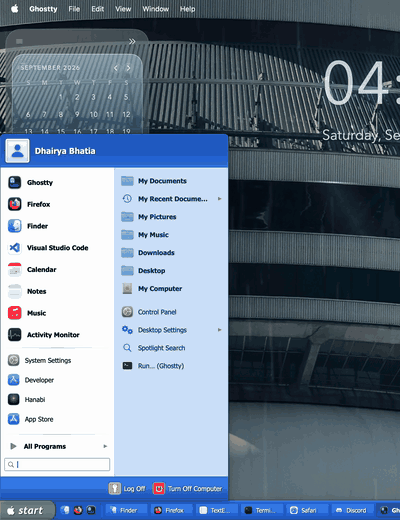
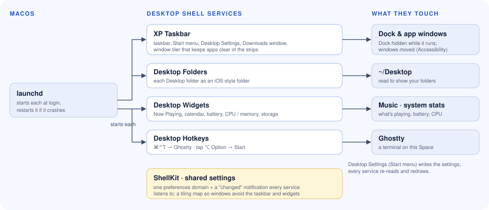

<h1 align="center">Desktop Shell</h1>

<p align="center">
  A Windows XP-style taskbar and Start menu for macOS, with iOS-style desktop folders,<br>
  a glassy widget panel, and a couple of global hotkeys. Four small background services.
</p>

<p align="center">
  
</p>

---

Desktop Shell started as part of [Himawari](https://github.com/dhairyab0069/himawari-mac), the live
music wallpaper, and is now its own project. The two work well together (Himawari keeps its desktop
clock clear of the taskbar and widgets), but neither needs the other.

## What's in it

| Service | What it does |
|---|---|
| **XP Taskbar** | A Windows XP taskbar in place of the Dock, hidden in full-screen apps (push the pointer against the bottom edge to reveal it). **Start** (the Apple logo, or tap **⌥ Option**) opens an XP Start menu with pinned and frequent apps, All Programs, search (apps instantly, files via Spotlight), recent documents, your folders, **Desktop Settings** and Turn Off Computer, fully keyboard-driven. One button per open app, an XP-style **Downloads** window, a tray clock. Also a **window tiler** that keeps app windows out of the taskbar, widget and folder strips. |
| **Desktop Folders** | Every folder on your Desktop as an iOS-style folder (loose files grouped by type). Drag tiles to rearrange; click to zoom open. |
| **Desktop Widgets** | An Aero panel: Now Playing (with the album's animation), calendar, battery, CPU and memory, storage. Dock it to any edge. |
| **Desktop Hotkeys** | **⌘⌃T** opens a Ghostty terminal on the current Space (the Quick Terminal over full-screen apps); **tap ⌥ Option** for Start. |

Everything is set from **Start ▸ Desktop Settings**.

## How it works

<p align="center"></p>

Each service is its own tiny app with no Dock or menu-bar icon, started at login by `launchd` and
restarted if it crashes, so one misbehaving part never takes the others down. They share `ShellKit`:
the Aero look, desktop-level windows, one preferences domain (`local.dhairyabhatia.desktop`) with a
"changed" notification every service listens to, and a tiling map of the screen so windows, folders
and widgets stay out of each other's way.

## Install

Requires macOS 14.4 or later and the Swift toolchain (Xcode or the Command Line Tools).

```bash
git clone https://github.com/dhairyab0069/desktop-shell-mac && cd desktop-shell-mac
tools/make_signing_identity.sh   # optional, once: macOS then keeps permissions across rebuilds
./install.sh                     # build, install, and start the services
```

Uninstall with `./install.sh --uninstall`: the services stop and are deleted, and your Dock and
Finder's desktop icons come back.

### Control the services

```bash
./desktopctl status              # what's running
./desktopctl stop    taskbar     # stop now (starts again at next login)
./desktopctl start   taskbar
./desktopctl restart all
./desktopctl disable folders     # stop, and don't start at login
./desktopctl enable  folders
```

Logs are in `~/Library/Logs/Desktop Shell/`.

### Permissions

macOS asks once for each, the first time it's needed. Missed one? Turn it on in **System Settings ▸
Privacy & Security**, then run `./desktopctl restart all`.

| Service | Permission | Why |
|---|---|---|
| XP Taskbar | **Accessibility** | The window tiler, and Start search. |
| XP Taskbar | **Downloads folder** | The Downloads window. |
| Desktop Folders | **Desktop folder** | Shows your folders. |
| Desktop Widgets | **Automation ▸ Music** | Now Playing. |
| Desktop Hotkeys | **Accessibility** | Notices a tap of ⌥ Option anywhere; opens Ghostty's Quick Terminal over full-screen apps. |

## Project layout

| Path | What's there |
|---|---|
| `Sources/XPTaskbar/` | Taskbar, Start menu (classic and modern), Desktop Settings, Downloads, window tiler. |
| `Sources/DesktopFolders/` | The desktop folders. |
| `Sources/DesktopWidgets/` | The widget panel. |
| `Sources/DesktopHotkeys/` | The hotkeys service. |
| `Sources/ShellKit/` | Shared: look, desktop windows, settings, tiling map, Now Playing, power state. |
| `build.sh`, `install.sh`, `scripts/shell.sh`, `desktopctl` | Build, install / remove, and control the services. |
| `tools/make_signing_identity.sh` | A local code-signing identity so permissions survive rebuilds. |

## AI assistance

Desktop Shell was built with [Claude Code](https://claude.com/claude-code), Anthropic's AI coding
assistant, as a pair programmer: the author decided what to build and how it should look and behave
and tested every change on their own Mac; Claude wrote most of the code. Treat all of it as written
with AI help: it's a tested personal project, not an audited product.

## Privacy

No accounts, analytics or telemetry. Nothing leaves your Mac except the Now Playing widget's lookups
of album artwork on Apple's public iTunes Search API and Apple Music pages (and YouTube's embedded
player, if you turn on its YouTube loop).

## Licence

Released under the [MIT License](LICENSE). It comes with no warranty.
